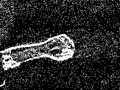
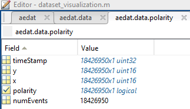

## Dataset source:
https://zenodo.org/record/3228846#.YyKTdnZBxaQ

---

## Example of dataset：

---

## NOTE: 

### data format

.mat (exported data): mat structure, name 'aedat', events are inside aedat.data.polarity (

	aedat.data.polarity.x,
	
	aedat.data.polarity.y,
	
	aedat.data.polarity.timeStamp,
	
	aedat.data.polarity.polarity), 
	
aps frames are inside aedat.data.frame.samples, 

timestamps are in aedat.data.frame.timeStampStart (start of frame collection) or aedat.data.frame.timeStampEnd (end of frame collection).

### image resolution

image size: 240x180

aedat.data.polarity.x $\in$ [0,239]

aedat.data.polarity.y $\in$ [0,179]

